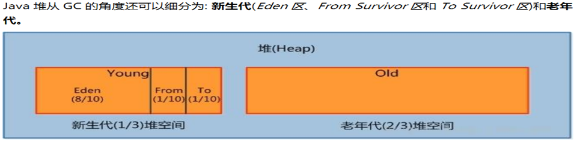

## JVM

- JVM体系结构


### 一、类加载器

- 类装载器ClassLoader：负责加载class文件，class文件在文件开头有特定的文件标识，将class文件字节码内容加载到内存中，并将这些内容转换成方法区中的运行时数据结构并且ClassLoader只负责class文件的加载，是否可以运行，由Execution Engine决定。-
- 类加载器分为虚拟机自带的加载器和用户自定义加载器。
  - 自带加载器又分为 ①启动类加载器（Bootstrap）②扩展类加载器（Extension）③ 应用程序类加载器（AppClassLoader）,加载当前应用的classpath的所有类。
    - 用户自定义加载器  Java.lang.ClassLoader的子类，用户可以定制类的加载方式。

Bootstrap      $javahome/jre/rt.jar

Extension   $javahome/jre/lib/*.jar

System Class Loader (AppClassLoader)  $classpath

User defined Class Loader     用户自定义的加载器是通过sun.misc.Launcher入口。

### 二、双亲委派

- 当一个类收到类加载请求，它首先不会尝试加载这个类，而是将请求委派给父类加载，当父类无法加载，则向下传递请求，最后会到子类加载器尝试自己去加载，这样的好处是不会污染父加载器的环境及类。
- 采用双亲委派的一个好处是比如加载位于 rt.jar 包中的类 java.lang.Object，不管是哪个加载器加载这个类，最终都是委托给顶层的启动类加载器进行加载，这样就保证了使用不同的类加载器最终得到的都是同样一个 Object对象。 

### 三、执行引擎

Execution Engine执行引擎负责解释命令，提交操作系统执行。 

### 四、native

native 是调用底层接口。

### 五、native 方法区和方法区的区别

native方法区存放的是登记native关键字的方法。

方法区存放的是每一个类的结构信息，供各线程共享的运行时内存区域。例如：运行时常量池、字段和方法数据、构造函数和普通方法的字节码内容。

<font color = red>注意：实例变量存放在堆内存中。</font>

### 六、stack 栈

栈也叫栈内存。主管java程序的运行，是在线程创建是创建，它的生命期是跟随线程的生命周期。栈不存在垃圾回收问题。栈是线程私有的，8种基本类型的变量，对象的引用变量，实例方法都是在函数的栈内存中分配的。

- 栈存储一下数据：
  - 本地变量：输入参数和输出参数以及方法内的变量。
  - 栈操作：记录出栈、入栈的操作。
  - 栈帧数据：包括类文件、方法等

每个方法执行的同时都会创建一个栈帧，用于存储局部变量表、操作数栈、动态链接、方法出口等信息，每一个方法从调用直至执行完毕的过程，就对应着一个栈帧在虚拟机中入栈到出栈的过程。

当一个方法迭代调用自己，此时会产生异常，栈溢出。java.lang.StackOverflowError

### 七、栈、堆、方法区的交互关系


java堆中存放类元数据的地址，栈中对象的引用存储的是对象的地址。

### 八、堆 Heap

一个JVM实例只存在一个堆内存，堆内存的大小是可以调节的。类加载器读取了类文件后，需要把类、方法、常变量放在堆内存中。保存所有引用类型的真实信息，以方便执行器执行，堆内存分为以下三部分：

- 新生代 young ，新生代又分为伊甸区、幸存区(from survivor  、 to  survivor)
- 老年代 old
- 永久代 perm

<font color = red>如果出现java.lang.OutOfMemoryError: Java heap space异常，说明Java虚拟机的堆内存不够。原因有二：
（1）Java虚拟机的堆内存设置不够，可以通过参数-Xms、-Xmx来调整。
（2）代码中创建了大量大对象，并且长时间不能被垃圾收集器收集（存在被引用）。</font>

### 九、堆、栈、方法区存储

- 栈中存储着基本数据类型、对象引用，包装类的字面值。
- 方法区中存储着class文件，static变量和方法。
- 堆中存储着所有new出来的对象。（访问类元数据的地址）

所以堆、栈、方法区的交互方式如上面标题所示，栈中的对象引用指向堆中new出来的对象，（指到对象类型数据的指针），堆中的对象实例数据接下来访问方法区中对象类型数据。


堆、栈、方法区、常量池的存储机制可以参考这边文章：https://blog.csdn.net/qq_26805137/article/details/52996910
https://blog.csdn.net/gcw1024/article/details/51026840
https://www.cnblogs.com/xiaowangbangzhu/p/10366200.html

注意：java6和6以前，常量池是存放在方法区中的。java7，常量池存放在堆中，常量池相当于永久代，所以永久代存放在堆中。java8之后，取消了永久代，取代的是元空间，没有对常量池进行调整。

### 十、常量池

java中常量池，实际上分为静态常量池和运行时常量池。

- 静态常量池，即*.class文件中的常量池，class文件中的常量池不仅包含字符串（数字字面量），还包含类、方法的信息。主要存放两大类常量，字面量（Literal） 和符号引用量（Symbolic References），字面量相当于java语言层面常量的概念，如文本字符串、声明为final的常量值等，符号引用则属于编译原理方面的概念，包括如下三种类型的常量：
  - 类和接口的全限定名
  - 字段名称和描述符
  - 方法名称和描述符
- 运行时常量池，Class文件中除了有类的版本、字段、方法、接口等描述信息外，还有一项信息是常量池，用于存放编译期生成的各种字面量和符号引用，这部分内容将在类加载后进入方法区的运行时常量池中存放。
  - 另外运行时常量池具备动态性，运行期间也可能将新的常量放入池中，例如String类的intern()	方法。 

### 十一、堆 （Heap）

一个jvm实例只存爱一个堆内存，堆内存的大小是可以调节的。类加载器读取了类文件后，需要把类、方法、常变量放到堆内存中，保存所有引用类型的真实信息，以方便执行器执行。堆内存分为三部分：

- Young Generation Space  新生区  占堆内存1/3
- Tenure Generation Space 养老区   占堆内存 2/3
- Permanent Space 永久区     （ 8 以后改为MetaSpace 元空间）



如上图所示，新生代又分为伊甸区，幸存者from区，幸存者to区，占比为8:1:1。

#### MinorGC  适用于新生代   复制算法

当发生垃圾清理时，首次gc，eden区进行清理，将清理完剩余的对象拷贝到幸存者from区，当eden区再次出发gc的时候会扫描eden区和幸存者from区，对着两个区域进行垃圾回收，经过这次回收将还存活的对象复制到幸存者to区，然后清空eden区和from区，之后将原本的from区改为to区，进行交换，原survivorFrom区变成to区，to区成为from区，如此交换15次（由jvm参数MaxTenuringThreshold决定），最终将还存活的对象存入老年代。这就是MinorGC的复制算法。

优点：没有标记和清除的过程，效率高，没有内存碎片；
缺点：复制需要双倍空间。

#### 标记清除算法

算法分为标记和清除两个阶段，先标记要回收的对象，然后统一回收这些对象。主要进行两项工作，第一项是标记，第二项是清除。
标记：从引用根节点开始标记遍历所有的GC Roots，先标记出要回收的对象。
清除：遍历整个堆，把标记的对象清除。

优点：不需要额外空间。
缺点：两次扫描，耗时严重，会产生内存碎片。

#### 标记压缩算法

为了解决标记清除的产生内存碎片的缺点，出现了标记压缩算法。主要进行标记、压缩两项工作。
标记过程和标记清除算法一样，但在整理压缩阶段，不再对标记的对象做回收，而是通过所有存活对象都向一端移动，然后直接清除边界以外的内存。可以看到标记存活对象将会被亨利，按照内存地址一次排序，而未被标记的内存会被清除掉。如此一来，当我们需要对新对象分配内存时，jvm只需持有一个内存的起始地址即可，这比维护一个空闲列表少了许多开销。

优点：弥补标记清除算法中内存区域分散的缺点，也消除了复制算法中内存减半的高额代价。
缺点：不仅需要标记，而且还需要移动对象，效率更低，比标记清除算法更低。

- 标记-清除-压缩
  原理是将标记清除和标记压缩结合，这样做的优点是减少额移动对象的成本。

***老年代一般是由标记清除或者是标记清除与标记整理的混合实现***

## volatile 和 synchronized的区别

synchronized 是排它锁，同时只能有一个线程访问对应方法，其他线程是阻塞状态，体现了原子性。

但volatile是非阻塞算法，volatile能保证内存可见性，但不能保证原子性。所以：

<font color =red>如果写入变量值不依赖变量当前值，那么就可以使用volatile</font>

```java
class Data{
    volatile int number = 10;
}
public class VolatileDemo {
    public static void main(String[] args) {
        Data data = new Data();
        new Thread(() -> {
            try {
                 Thread.sleep(3000);
                 data.number = 100;
                System.out.println(Thread.currentThread().getName()+data.number);
            } catch (Exception e) {
                e.printStackTrace();
            }
        },"A").start();

        System.out.println(data.number);
        while (data.number == 10){

        }
        System.out.println("break while");
    }
}
```

如上述代码，如果不加volatile关键字，则while循环为死循环，无法输出最后一行，程序将一直处于运行状态。而加了volatile关键字后,将数显number的内存可见性，循环判断条件即可跳出。

```java
public class VolatiteDemo2 {
    static volatile int num = 0;

    public static void main(String[] args) {
        VolatiteDemo2 volatiteDemo2 = new VolatiteDemo2();

        Thread a = new Thread(() -> {
            int start = 0;
            while (start++ < 100000) {
                num++;
                //加了输出语句会较少出现不正确例子
//                System.out.println(Thread.currentThread().getName() + ":" + num);
            }
        }, "A");

        Thread b = new Thread(() -> {
            int start = 0;
            while (start++ < 100000) {
                num++;
//                System.out.println(Thread.currentThread().getName() + ":" + num);
            }
        }, "B");

        a.start();
        b.start();

        try {
            a.join();
            b.join();
        } catch (InterruptedException e) {
            e.printStackTrace();
        }
        System.out.println("Number:"+ num);
    }
}
```

上述代码中，当进行volatile++这样的复合操作时，不能保证原子性，因为cpu执行执行volatile++是三行操作，volatile关键字不是阻塞算法，不保证其他线程不操作，从而导致结果出现错误。（输出的num值在100000~20000之间变化）

## 布隆过滤器

利用平衡术或者Trie或者AC自动机等数据结构和算法可以实现高效的查找，但是都需要存储所有的字符串。此时可以利用布隆过滤器。

布隆过滤器就是一维的bool型数组，也就是每一位只有0或1，是一个bit。对于每个新增的项，数组长度为m，我们使用k中不同的hash算法对它计算hash值，所以我们可以得到k个hash值，我们用hash值对m取模，得到x。刚开始数组内都是0，我们把所有x对应的位置置1。

bool型的布隆过滤器不支持删除，因为很多元素共享某一位，如果删除的话，会影响到其他元素的判断。

不过我们可以修改数据结构，将原来的bool型改为int型，当我们插入元素时，不再是将bit置为true，而是对应位置自增，当该位置的值大于0，表示有元素使用了该位置，删除元素时，对应位会自减。不过这样的方法不是完美的，由于存在误判，很有可能删除原本就不存在的值，这样同样会对其他元素产生影响。

布隆过滤器是一个优缺点非常明显的数据结构，优点：速度快，内存消耗小，代码实现简单。
缺点：不支持删除元素，会有误判情况。