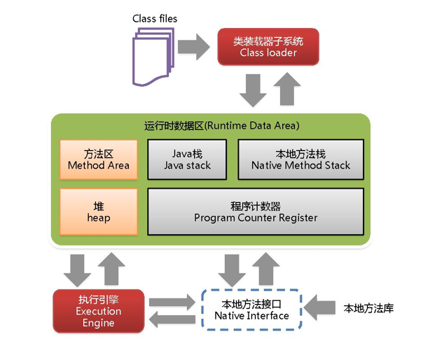
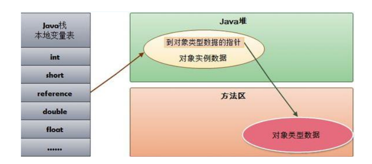
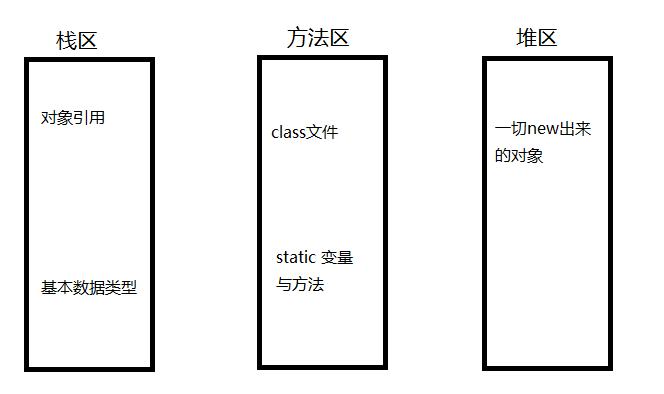

## JVM

- JVM体系结构

### 类加载器

- 类装载器ClassLoader：负责加载class文件，class文件在文件开头有特定的文件标识，将class文件字节码内容加载到内存中，并将这些内容转换成方法区中的运行时数据结构并且ClassLoader只负责class文件的加载，是否可以运行，由Execution Engine决定。-
- 类加载器分为虚拟机自带的加载器和用户自定义加载器。
		- 自带加载器又分为 ①启动类加载器（Bootstrap）②扩展类加载器（Extension）③ 应用程序类加载器（AppClassLoader）,加载当前应用的classpath的所有类。
		- 用户自定义加载器  Java.lang.ClassLoader的子类，用户可以定制类的加载方式。

Bootstrap      $javahome/jre/rt.jar

Extension   $javahome/jre/lib/*.jar

System Class Loader (AppClassLoader)  $classpath

User defined Class Loader     用户自定义的加载器是通过sun.misc.Launcher入口。

### 双亲委派

- 当一个类收到类加载请求，它首先不会尝试加载这个类，而是将请求委派给父类加载，当父类无法加载，则向下传递请求，最后会到子类加载器尝试自己去加载，这样的好处是不会污染父加载器的环境及类。

- 采用双亲委派的一个好处是比如加载位于 rt.jar 包中的类 java.lang.Object，不管是哪个加载器加载这个类，最终都是委托给顶层的启动类加载器进行加载，这样就保证了使用不同的类加载器最终得到的都是同样一个 Object对象。 

### 执行引擎

Execution Engine执行引擎负责解释命令，提交操作系统执行。 

### native

native 是调用底层接口。

### native 方法区和方法区的区别

native方法区存放的是登记native关键字的方法。

方法区存放的是每一个类的结构信息，供各线程共享的运行时内存区域。例如：运行时常量池、字段和方法数据、构造函数和普通方法的字节码内容。

注意：实例变量存放在堆内存中。

### stack 栈

栈也叫栈内存。主管java程序的运行，是在线程创建是创建，它的生命期是跟随线程的生命周期。栈不存在垃圾回收问题。栈是线程私有的，8种基本类型的变量，对象的引用变量，实例方法都是在函数的栈内存中分配的。
-  栈存储一下数据：
	- 本地变量：输入参数和输出参数以及方法内的变量。
	- 栈操作：记录出栈、入栈的操作。
	- 栈帧数据：包括类文件、方法等

每个方法执行的同时都会创建一个栈帧，用于存储局部变量表、操作数栈、动态链接、方法出口等信息，每一个方法从调用直至执行完毕的过程，就对应着一个栈帧在虚拟机中入栈到出栈的过程。

当一个方法迭代调用自己，此时会产生异常，栈溢出。java.lang.StackOverflowError

### 栈、堆、方法区的交互关系

java堆中存放类元数据的地址，栈中对象的引用存储的是对象的地址。

### 堆 Heap

一个JVM实例只存在一个堆内存，堆内存的大小是可以调节的。类加载器读取了类文件后，需要把类、方法、常变量放在堆内存中。保存所有引用类型的真实信息，以方便执行器执行，堆内存分为以下三部分：
- 新生代 young ，新生代又分为伊甸区、幸存区(from survivor  、 to  survivor)
- 老年代 old
- 永久代 perm

如果出现java.lang.OutOfMemoryError: Java heap space异常，说明Java虚拟机的堆内存不够。原因有二：
（1）Java虚拟机的堆内存设置不够，可以通过参数-Xms、-Xmx来调整。
（2）代码中创建了大量大对象，并且长时间不能被垃圾收集器收集（存在被引用）。

https://blog.csdn.net/qq_26805137/article/details/52996910

## volatile 和 synchronized的区别

synchronized 是排它锁，同时只能有一个线程访问对应方法，其他线程是阻塞状态，体现了原子性。

但volatile是非阻塞算法，volatile能保证内存可见性，但不能保证原子性。所以：

如果写入变量值不依赖变量当前值，那么就可以使用volatile

## 布隆过滤器

利用平衡术或者Trie或者AC自动机等数据结构和算法可以实现高效的查找，但是都需要存储所有的字符串。此时可以利用布隆过滤器。

布隆过滤器就是一维的bool型数组，也就是每一位只有0或1，是一个bit。对于每个新增的项，数组长度为m，我们使用k中不同的hash算法对它计算hash值，所以我们可以得到k个hash值，我们用hash值对m取模，得到x。刚开始数组内都是0，我们把所有x对应的位置置1。

bool型的布隆过滤器不支持删除，因为很多元素共享某一位，如果删除的话，会影响到其他元素的判断。

不过我们可以修改数据结构，将原来的bool型改为int型，当我们插入元素时，不再是将bit置为true，而是对应位置自增，当该位置的值大于0，表示有元素使用了该位置，删除元素时，对应位会自减。不过这样的方法不是完美的，由于存在误判，很有可能删除原本就不存在的值，这样同样会对其他元素产生影响。

布隆过滤器是一个优缺点非常明显的数据结构，优点：速度快，内存消耗小，代码实现简单。
缺点：不支持删除元素，会有误判情况。